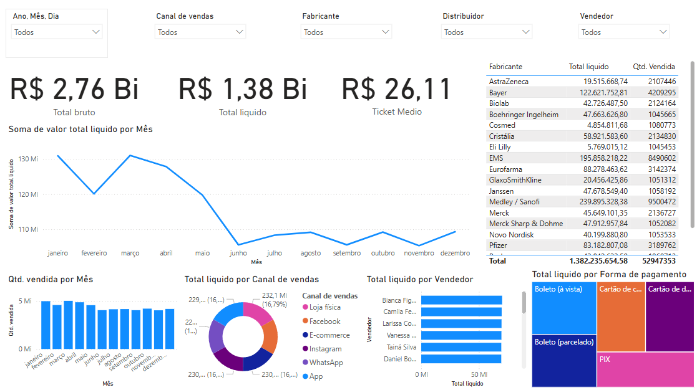

# 📊 Análise de Vendas Farmacêuticas com Power BI

Este projeto apresenta uma análise interativa de mais de **1 milhão de registros de vendas** no setor farmacêutico. O objetivo principal é explorar insights sobre desempenho comercial, canais de vendas, formas de pagamento e margens por fabricante e vendedor, utilizando o Power BI.

⚠️ **Nota:** Os dados utilizados neste projeto são simulados/fictícios e não representam transações reais.

---

## 🎯 Objetivo

Transformar um grande volume de dados brutos em **visualizações estratégicas** que auxiliem a tomada de decisão em áreas como:

- Gestão Comercial
- Performance de Vendas
- Descontos e Rentabilidade
- Estratégias de Canais e Pagamentos

---

## 📁 Fontes de Dados

- Arquivo Excel (.xlsx) com 1.048.576 de linhas por 13 colunas.
- Dados simulados de vendas: data, distribuidor, CNPJ do cliente, valor unitário, desconto, quantidade, valores brutos e líquidos, forma de pagamento, ID do vendedor e canal de vendas.

---

## 🛠️ Ferramentas Utilizadas

- **Power BI Desktop**
- **DAX (Data Analysis Expressions)**
- **Excel** (para limpeza e pré-processamento)
- **Modelagem Estrela** para desempenho e clareza analítica

---

## 📈 KPIs Criados

- **Receita Bruta e Receita Líquida**
- **Ticket Médio** (`Receita Líquida / Quantidade Vendida`)
- **Volume Total de Vendas**
- **Ranking de Fabricantes e Vendedores**
- **Distribuição por Forma de Pagamento e Canal de Vendas**

---

## 🧩 Layout do Dashboard

O dashboard foi organizado em seções:

1. **Visão Geral** – KPIs principais e filtros globais
2. **Análise Temporal** – Evolução de receita e volume de vendas
3. **Análise por Fabricante** – Top fabricantes e margens
4. **Desempenho de Vendedores** – Ranking, ticket médio, descontos
5. **Canais e Formas de Pagamento** – Participação e performance
6. **Detalhamento de Vendas** – Drill-through por transação

---

## 💡 Principais Insights

- O **Canal de vendas** loja física foi responsável pela maior receita líquida.
- Vendas com **boleto à vista** apresentaram maior ticket médio.
- O fabricante **Medley / Sanofi** liderou em faturamento total.

---

## 📎 Captura de tela

| Visão Geral |
|------------|
|  |

---

## 🚀 Como Visualizar

Se você quiser interagir com o dashboard:

- Clone este repositório e abra o arquivo `.pbix` com Power BI Desktop.

---

## 📬 Contato

Se quiser conversar mais detalhes sobre esse projeto:

- Email: gabrielfelipeatt@gmail.com

---

## 📌 Licença

Este projeto está sob a licença MIT. Veja o arquivo `LICENSE` para mais detalhes.
